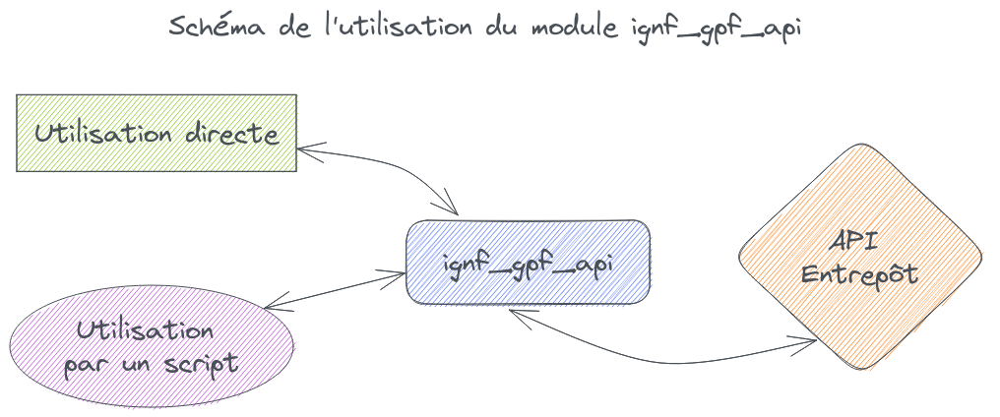

# API Python pour la Géoplateforme

L'API Géoplateforme vous permet de téléverser, traiter puis publier vos données géographique. Bien que très puissante, cette API n'est pas aisée à prendre en main. Ce module Python a été créé afin de vous permettre d'utiliser la Géoplateforme facilement.

Vous pouvez l'utiliser directement en ligne de commande pour un usage simple ou l'intégrer dans vos script Python pour un usage avancé entièrement personnalisable.



## Installation

Installez le module via pip :

```sh
pip install ignf_gpf_api
```

Vous pouvez ensuite l'[utiliser comme exécutable](comme-executable.md) ou l'[importer dans vos scripts Python](comme-module.md).

## Tutoriels

Des tutoriels sont disponibles pour voir des cas concrets d'utilisation de A à Z :

* [Tutoriel 1 : héberger une archive pour la rendre téléchargeable](tutoriel_1_archive.md)
* [Tutoriel 2 : téléverser des données vecteur et les publier en flux](tutoriel_2_flux_vecteur.md)

## Développement

Si vous souhaitez participer au développement du projet, consultez le [document détaillant comment procéder](development.md).
