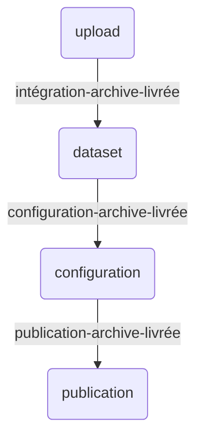

# Tutoriel 1 : publier une archive

La Géoplateforme permet d'héberger vos fichiers pour permettre à vos utilisateur de les télécharger simplement.

Pour cela, vous devez téléverser des données « archive » (c'est à dire qu'elles ne seront pas retouchées par la Géoplateforme).

Pour commencer, nous vous conseillons de suivre ce tutoriel qui vous permet de manipuler des données déjà existantes. Vous pouvez ensuite adapter chaque étape pour livrer vos données.

## Définition de la configuration

Suivez la page [configuration](configuration.md) pour définir le fichier de configuration.

## Récupération du jeu de données

Le jeu de données « 2_dataset_archive » contient des données archives à téléverser.

Récupérez les données en lançant la commande :

```sh
python -m ignf_gpf_api dataset -n 2_dataset_archive
```

Observez la structure du jeu de données :

```txt
2_dataset_archive/
├── CANTON
│   └── CANTON.zip
├── CANTON.md5
└── upload_descriptor.json
```

La donnée que l'on souhaite héberger est le fichier `CANTON.zip`. Le fichier `CANTON.md5` permettra de valider les données téléversées côté Géoplateforme.

Enfin, le fichier `upload_descriptor.json` permet de décrire la livraison à effectuer.

## Fichier descripteur de livraison

Ouvrez le fichier pour avoir plus de détails.

Il est composé d'une liste de `datasets` représentant chacun une livraison distincte.

Chaque dataset contient :

* la liste des dossiers à téléverser ;
* les informations de la livraison à créer (nom, description, srs et type) ;
* les commentaires et les tags à ajouter à la livraison.

La documentation du ficher descripteur est disponible [ici](upload_descriptor.md).

## Livraison des données

Livrer les données en indiquant le chemin du fichier descripteur au programme :

```sh
python -m ignf_gpf_api upload -f 2_dataset_archive/upload_descriptor.json
```

Le programme doit vous indiquer que le transfert est en cours, puis qu'il attend la fin des vérifications côté API avant de conclure que tout est bon.

## Workflow

Une fois les données livrées, il faut traiter les données avant de les publier (c'est à dire configurer un géo-service et le rendre accessible).

Ces étapes sont décrites grâces à un workflow.

Vous pouvez récupérer un workflow d'exemple grâce à la commande suivante :

```sh
python -m ignf_gpf_api workflow -n archive-generic.jsonc
```

Ouvrez le fichier. Vous trouverez plus de détails dans la [documentation sur les workflows](workflow.md), mais vous pouvez dès à présent voir que le workflow est composé de 3 étapes. Il faudra lancer une commande pour chacune d'elles.



## Traitement et publication

Le workflow « archive-generic » permet de passer de la livraison à une lien permettant de télécharger la donnée. Il comporte 3 étapes :

* `intégration-archive-livrée` : transformation des données livrées temporaires en une Donnée Stockée pérenne ;
* `configuration-archive-livrée` : configuration d'un service de téléchargement permettant de télécharger les données ;
* `publication-archive-livrée` : publication du service de téléchargement.

Lancez les 3 commandes suivantes pour exécuter les 3 étapes :

```sh
python -m ignf_gpf_api workflow -f archive-generic.jsonc -s intégration-archive-livrée
python -m ignf_gpf_api workflow -f archive-generic.jsonc -s configuration-archive-livrée
python -m ignf_gpf_api workflow -f archive-generic.jsonc -s publication-archive-livrée
```

La première commande ne doit pas être instantanée : un traitement est effectué et les logs doivent vous être remontés.

Les deux étapes suivantes sont instantanées. A la fin, vous devez voir s'afficher un lien.

Exemple :

```txt
INFO - Offre créée : Offering(id=62c708e72246434ac40ee3ad)
   - download|https://geoservices-geotuileur.ccs-ign-plage.ccs.cegedim.cloud/download/plage/archive
```

Suivez le lien indiqué pour retrouver la liste des fichiers que vous avez téléversées et qui sont maintenant disponibles en téléchargement.

Vous pouvez alors télécharger le fichier de votre choix en ajoutant son nom à la suite du lien. Dans notre cas, ça serait :

```txt
https://geoservices-geotuileur.ccs-ign-plage.ccs.cegedim.cloud/download/plage/archive/CANTON.zip
```

## Résumer des commandes

```sh
# récupération des données test
python -m ignf_gpf_api dataset -n 2_dataset_archive
# livraison des données sur la geoplatforme
python -m ignf_gpf_api upload -f 2_dataset_archive/upload_descriptor.json
# récupération du workflow d'archive
python -m ignf_gpf_api workflow -n archive-generic.jsonc
# exécution des 3 étapes pour la publication de l'archive
python -m ignf_gpf_api workflow -f archive-generic.jsonc -s intégration-archive-livrée
python -m ignf_gpf_api workflow -f archive-generic.jsonc -s configuration-archive-livrée
python -m ignf_gpf_api workflow -f archive-generic.jsonc -s publication-archive-livrée
```
