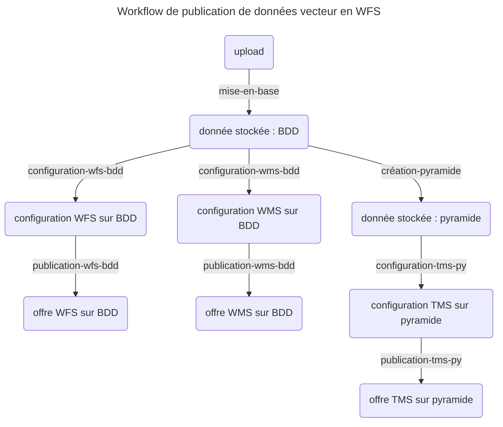

# Tutoriel 2 : publier un flux vecteur

La Géoplateforme permet d'héberger des flux vecteur pour permettre à vos utilisateurd de les télécharger/utiliser.

Pour cela, vous devez téléverser des données « vecteur » sur lesquelles la Géoplateforme va effectuer des traitements.

Pour commencer, nous vous conseillons de suivre ce tutoriel qui vous permet de manipuler des données déjà existantes. Vous pouvez ensuite adapter chaque étape pour livrer vos données.

## Définition de la configuration

Suivez la page [configuration](configuration.md) pour définir le fichier de configuration.

## Récupération du jeu de données

Le jeu de données « 1_dataset_vector » contient des données vecteur à téléverser.

Récupérez les données en lançant la commande :

```sh
python -m ignf_gpf_api dataset -n 1_dataset_vector
```

Observez la structure des données :

```txt
1_dataset_vector
├── CANTON
│   ├── CANTON.cpg
│   ├── CANTON.dbf
│   ├── CANTON.prj
│   ├── CANTON.shp
│   └── CANTON.shx
├── CANTON.md5
├── CANTON_style.sld
└── upload_descriptor.json
```

Les données que la Géoplateforme va traiter sont situées dans le dossier `test`.
Le fichier `test.md5` permettra de valider les données téléversées côté Géoplateforme.

Enfin, le fichier `upload_descriptor.jsonc` permet de décrire la livraison à effectuer.

## Fichier descripteur de livraison

Ouvrez le fichier `upload_descriptor.jsonc` pour avoir plus de détails.

Il est composé d'une liste de `datasets` représentant chacun une livraison distincte.

Chaque dataset contient :

* la liste des dossiers à téléverser ;
* les informations de la livraison à créer (nom, description, srs et type) ;
* les commentaires et les tags à ajouter à la livraison. (Memo : les commentaires ne sont pas encore supportées par la version actuelle de la GPF)

## Livraison des données

Livrer les données en indiquant le chemin du fichier descripteur au programme :

```sh
python -m ignf_gpf_api upload -f 1_dataset_vector/upload_descriptor.json
```

Le programme doit vous indiquer que le transfert est en cours, puis qu'il attend la fin des vérifications côté API avant de conclure que tout est bon.

## Workflow

Une fois les données livrées, il faut traiter les données avant de les publier (c'est à dire effectuer un (ou plusieurs) géo-traitement(s), puis configurer un géo-service et le rendre accessible).

Ces étapes sont décrites grâce à un workflow.

Vous pouvez récupérer un workflow d'exemple grâce à la commande suivante :

```sh
python -m ignf_gpf_api workflow -n generic_vecteur.jsonc
```

Memo: Dans la version actuelle de la GPF, les commentaires ne fonctionnent pas et les étiquettes (tags) n'ont pas été testées.

Ouvrez le fichier. Vous trouverez plus de détails dans la [documentation sur les workflows](workflow.md), mais vous pouvez dès à présent voir que le workflow est composé de 4 étapes. Il faudra lancer une commande pour chacune d'elles.



## fichier statique

Pour publier les données en WMS il faut appliquer un style aux données. La partie versement d'un style ne peut pas encore se faire avec `ignf_gpf_api`. Il faut donc ajouté le ficher de style à la mains avec swagger, Insomnia ou en ligne de commande. Tutoriel [ICI](https://gpf-beta.ign.fr/geoplateforme/tutoriels/vecteur/gestion_statique/)

Un fichier statique ([CANTON_style.sld](https://raw.githubusercontent.com/ignf-sidc/ignf-gpf-api/prod/ignf_gpf_api/_data/datasets/1_dataset_vector/CANTON_style.sld)) pour le tuto est disponible dans le jeu de données test. Pour l'utiliser avec le workflow sans modification il faut le livrer avec `"name": "style_canton"`.
Si vous modifiez le nom du fichier de style il faut modifier dans le workflow la partie "configuration-wms".

## Traitement et publication

Le workflow « generic_vecteur » permet de passer de la livraison à 3 flux servant la donnée. Il comporte 8 étapes :

* `mise-en-base` : mise en base des données vecteur livrées ;
* Publication WFS depuis la base :
  * `configuration-wfs-bdd` : configuration d'un service de flux WFS permettant d'utiliser les données vecteur ;
  * `publication-wfs-bdd` : publication du service de flux WFS sur le bon endpoint.
* Publication WMS depuis la base :
  * `configuration-wms-bdd` : configuration d'un service de flux WMS permettant d'utiliser les données vecteur ;
  * `publication-wms-bdd` : publication du service de flux WMS sur le bon endpoint.
* Mise en pyramide et publication :
  * `création-pyramide` : création de la pyramide de vecteur pour l'utilisation dans un flux ;
  * `configuration-tms-py` : configuration d'un service de flux TMS permettant d'utiliser les données vecteur ;
  * `publication-tms-py` : publication du service de flux TMS sur le bon endpoint.

Les étapes "configuration + publication" des flux WMS et WFS sont indépendantes.

Lancez les 8 commandes suivantes pour exécuter les 8 étapes :

```sh
python -m ignf_gpf_api workflow -f generic_vecteur.jsonc -s mise-en-base
# WFS depuis BDD
python -m ignf_gpf_api workflow -f generic_vecteur.jsonc -s configuration-wfs-bdd
python -m ignf_gpf_api workflow -f generic_vecteur.jsonc -s publication-wfs-bdd
# WMS depuis BDD
python -m ignf_gpf_api workflow -f generic_vecteur.jsonc -s configuration-wms-bdd
python -m ignf_gpf_api workflow -f generic_vecteur.jsonc -s publication-wms-bdd
# création pyramide et WFS
python -m ignf_gpf_api workflow -f generic_vecteur.jsonc -s création-pyramide
python -m ignf_gpf_api workflow -f generic_vecteur.jsonc -s configuration-wfs-py
python -m ignf_gpf_api workflow -f generic_vecteur.jsonc -s publication-wfs-py
```

Les commandes de mise en base et de création de pyramides ne sont pas instantanées : un traitement est effectué et les logs doivent vous être remontés.

Les étapes de configuration et publication sont instantanées. A la fin de la publication, vous devez voir s'afficher un lien.

Exemple :

```txt
INFO - Offre créée : Offering(id=62c708e72246434ac40ee3ad)
   - https://data.geopf.fr/wms-v/ows?service=wms&version=1.3.0&request=DescribeLayer&layers=ludi_bdd__Flux_vecteur_WMS
```
