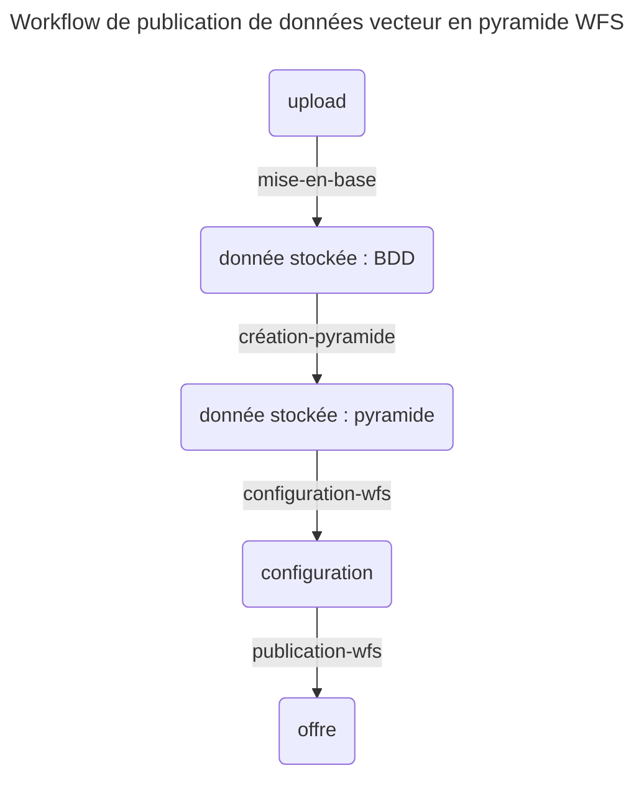

# Tutoriel 2 : publier un flux vecteur

La Géoplateforme permet d'héberger des flux vecteur pour permettre à vos utilisateur de les télécharger/utiliser.

Pour cela, vous devez téléverser des données « vecteur » sur lesquelles la Géoplateforme va effectuer des traitements.

Pour commencer, nous vous conseillons de suivre ce tutoriel qui vous permet de manipuler des données déjà existantes. Vous pouvez ensuite adapter chaque étape pour livrer vos données.

## Définition de la configuration

Suivez la page [configuration](configuration.md) pour définir le fichier de configuration.

## Récupération du jeu de données

Le jeu de données « 1_dataset_vector » contient des données vecteur à téléverser.

Récupérez les données en lançant la commande :

```sh
python -m ignf_gpf_api dataset -n 1_dataset_vector
```

Observez la structure des données :

```
1_dataset_vector/
├── CANTON
│   ├── CANTON.cpg
│   ├── CANTON.dbf
│   ├── CANTON.prj
│   ├── CANTON.shp
│   └── CANTON.shx
├── CANTON.md5
└── upload_descriptor.json
```

Les données que la Géoplateforme va traiter sont situées dans le dossier `CANTON`.
Le fichier `CANTON.md5` permettra de valider les données téléversées côté Géoplateforme.

Enfin, le fichier `upload_descriptor.json` permet de décrire la livraison à effectuer.


## Fichier descripteur de livraison

Ouvrez le fichier pour avoir plus de détails.

Il est composé d'une liste de `datasets` représentant chacun une livraison distincte.

Chaque dataset contient :

* la liste des dossiers à téléverser ;
* les informations de la livraison à créer (nom, description, srs et type) ;
* les commentaires et les tags à ajouter à la livraison.

## Livraison des données

Livrer les données en indiquant le chemin du fichier descripteur au programme :

```sh
python -m ignf_gpf_api upload -f 1_dataset_vector/upload_descriptor.json
```

Le programme doit vous indiquer que le transfert est en cours, puis qu'il attend la fin des vérifications côté API avant de conclure que tout est bon.

## Workflow

Une fois les données livrées, il faut traiter les données avant de les publier (c'est à dire effectuer un (ou plusieurs) géo-traitement(s),
puis configurer un géo-service et le rendre accessible).

Ces étapes sont décrites grâce à un workflow.

Vous pouvez récupérer un workflow d'exemple grâce à la commande suivante :

```sh
python -m ignf_gpf_api workflow -n wfs-generic.jsonc
```

Ouvrez le fichier. Vous trouverez plus de détails dans la [documentation sur les workflows](workflow.md), mais vous pouvez dès à présent voir que le workflow est composé de 4 étapes. Il faudra lancer une commande pour chacune d'elles.



## Traitement et publication

Le workflow « wfs-generic » permet de passer de la livraison à un flux WFS servant la donnée. Il comporte 4 étapes :

* `mise-en-base` : mise en base des données vecteur livrées ;
* `création-pyramide` : création de la pyramide de vecteur pour l'utilisation dans un flux ;
* `configuration-wfs` : configuration d'un service de flux WFS permettant d'utiliser les données vecteur ;
* `publication-wfs` : publication du service de flux WFS sur le bon endpoint.

Lancez les 4 commandes suivantes pour exécuter les 4 étapes :

```sh
python -m ignf_gpf_api workflow -f wfs-generic.jsonc -s mise-en-base
python -m ignf_gpf_api workflow -f wfs-generic.jsonc -s création-pyramide
python -m ignf_gpf_api workflow -f wfs-generic.jsonc -s configuration-wfs
python -m ignf_gpf_api workflow -f wfs-generic.jsonc -s publication-wfs
```

Les deux premières commandes ne doivent pas être instantanées : un traitement est effectué et les logs doivent vous être remontés.

Le deux traitements suivants sont instantanés. A la fin, vous devez voir s'afficher un lien.

Exemple :

```
INFO - Offre créée : Offering(id=62c708e72246434ac40ee3ad)
   - download|https://geoservices-geotuileur.ccs-ign-plage.ccs.cegedim.cloud/download/plage/
```

Suivez le lien indiqué pour retrouver le flux WFS.

Vous pouvez alors utiliser le flux.
